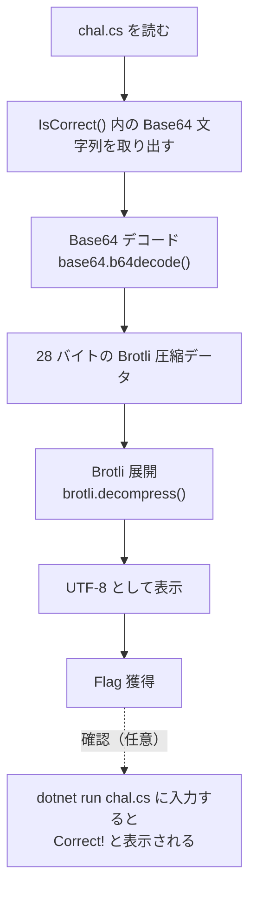

> [!IMPORTANT]
> **Solved with Gemini in Colab**
>
> この問題は Google の AI コーディングアシスタント **Gemini in Colab** を活用して解決されました。

> [!NOTE]
> この Writeup は AI により自動生成されています。 本ドキュメントは、AI アシスタントを用いて作成された Writeup です。記載内容は解法の一例であり、内容の正確性については十分にご確認の上ご利用ください。

# C# File-based app

## 概要
*   **カテゴリー**: Rev
*   **トピック**: .NET
*   **難易度**: Easy 2.5
*   **問題リンク**: [C# File-based app - Daily AlpacaHack](https://alpacahack.com/daily/challenges/csharp-file-based-app)

## 使用ツール
*   **Python 3**: 解法スクリプトの実装
*   **base64**: Base64 デコード（Python 標準ライブラリ）
*   **brotli**: Brotli 形式の展開（`pip install brotli`）
*   **.NET 10 SDK**: `chal.cs` を実際に動かして答えを確かめる（任意）
*   **Gemini in Colab**: 配布ファイルの解析およびコード生成

## 問題の分析
本問題は、**Daily AlpacaHack** の Rev 問題です。
配布ファイルは次の 2 つだけです。

| ファイル | 内容 |
| :--- | :--- |
| `chal.cs` | フラグ判定を行う C# のソースコード（1 ファイルだけ） |
| `run-using-docker.sh` | .NET 10 SDK の Docker イメージで `dotnet run -p:PublishAot=false /app/chal.cs` を実行するスクリプト |

`chal.cs` には `.csproj`（プロジェクトファイル）も `Main` メソッドもありません。これは .NET 10 で追加された **File-based apps** という機能を使っており、`dotnet run chal.cs` のように `.cs` ファイルを直接実行できます。

`chal.cs` の本体は次の通りです（冒頭のシバン行・コメント行と、Base64 文字列そのものは省略しています）。

```csharp
using System.Buffers.Text;
using System.IO.Compression;
using System.Text;

Console.Write("flag> ");
Console.Out.Flush();
string input = Console.ReadLine()?.Trim() ?? "";
Console.WriteLine(IsCorrect() ? $"Correct! The flag is {input}" : "Incorrect...");

bool IsCorrect()
{
    ReadOnlySpan<byte> encoded = "（40 文字の Base64 文字列）"u8;
    Span<byte> temp1 = stackalloc byte[256];
    Base64.DecodeFromUtf8(encoded, temp1, out _, out int bytesWritten1);

    Span<byte> temp2 = stackalloc byte[256];
    using var decoder = new BrotliDecoder();
    decoder.Decompress(temp1[..bytesWritten1], temp2, out _, out int bytesWritten2);

    Span<byte> temp3 = stackalloc byte[Encoding.UTF8.GetMaxByteCount(input.Length)];
    int bytesWritten3 = Encoding.UTF8.GetBytes(input, temp3);
    return temp2[..bytesWritten2].SequenceEqual(temp3[..bytesWritten3]);
}
```

`IsCorrect()` が行っているのは次の 3 ステップだけです。

1.  ソースに埋め込まれた文字列 `encoded` を **Base64 デコード** して `temp1` に書き込む
2.  `temp1` を **Brotli 展開** して `temp2` に書き込む
3.  入力文字列を UTF-8 のバイト列 `temp3` に変換し、`temp2` と **1 バイトずつ一致するか** を比較する

つまり、正解のフラグは「`encoded` を Base64 デコード → Brotli 展開」した結果そのものです。正解側のバイト列（`temp2`）は入力にまったく依存しないので、プログラムを実行しなくても、同じ変換を自分で行えばフラグが得られます。

## 脆弱性の詳細

### 正解データがプログラム内にそのまま入っている
フラグは暗号化されているわけではなく、**誰でも元に戻せる「符号化」と「圧縮」** を重ねただけの形でソースに埋め込まれています。どちらも鍵を必要としない可逆な変換なので、逆の手順をたどるだけで復元できます。

| 段階 | `chal.cs` での処理 | 逆にたどる処理（solve.py） |
| :--- | :--- | :--- |
| 1 | `Base64.DecodeFromUtf8(...)` | `base64.b64decode(...)` |
| 2 | `new BrotliDecoder().Decompress(...)` | `brotli.decompress(...)` |
| 3 | `SequenceEqual(...)` で入力と比較 | 展開結果を UTF-8 として表示 |

### Base64 デコード後のサイズ
Base64 は 4 文字で 3 バイトを表し、末尾の `=` はパディング（長さ合わせ）です。`encoded` は 40 文字で末尾が `==` なので、デコード後のバイト数は次のようになります。

$$
\frac{40}{4} \times 3 - 2 = 28 \ \text{バイト}
$$

実際に solve.py を実行すると、デコード結果は 28 バイトになり、先頭は `0x1b` で始まります。この 28 バイトが Brotli で圧縮されたデータです。

### Implicit using（暗黙的な using）に注意
`chal.cs` の先頭には `using System;` がありませんが、`Console`、`ReadOnlySpan<T>`、`Span<T>` などの `System` 名前空間の型を普通に使っています。これは .NET 6 で追加された **Implicit using directives** により、いくつかの名前空間が自動で `global using` されているためです。

実際に .NET 10 SDK（10.0.401）で `dotnet run chal.cs` を実行したところ、ビルド時に次の内容の `chal.cs.GlobalUsings.g.cs` が自動生成されていました。

```csharp
// <auto-generated/>
global using System;
global using System.Collections.Generic;
global using System.IO;
global using System.Linq;
global using System.Net.Http;
global using System.Threading;
global using System.Threading.Tasks;
```

API を調べるときは、ファイルに書かれた 3 つの `using`（`System.Buffers.Text`、`System.IO.Compression`、`System.Text`）に加えて、これらの名前空間も対象になっていることを意識しておく必要があります。

### 解法の流れ


### 別の方法（問題ページのヒント）
問題ページのヒントにある通り、Brotli は Python 以外でも扱えます。たとえば Node.js では標準の `zlib` モジュールで展開できます。

```js
const zlib = require("zlib");
const data = Buffer.from("（Base64 文字列）", "base64");
console.log(zlib.brotliDecompressSync(data).toString());
```

## 用語解説
*   **File-based apps**: .NET 10 で追加された機能です。プロジェクトファイル（`.csproj`）を用意しなくても、`dotnet run chal.cs` のように 1 つの `.cs` ファイルを直接ビルド・実行できます。`chal.cs` 1 行目の `#!/usr/bin/env dotnet` はシバン（shebang）で、Unix 系 OS で実行権限を付ければスクリプトのように起動できるようにするためのものです。
*   **トップレベルステートメント**: `class` や `Main` メソッドを書かずに、ファイルの先頭から処理を書ける C# の書き方です。`chal.cs` はこの形式で書かれており、`IsCorrect()` はその中のローカル関数です。
*   **Implicit using directives（暗黙的な using）**: .NET 6 で追加された機能で、`System` や `System.Linq` などよく使う名前空間を自動的に `global using` します。そのため `using System;` を書かなくても `Console` が使えます。
*   **Base64**: バイナリデータを英数字と `+`、`/`（パディングに `=`）だけで表すための符号化方式です。暗号ではないため、誰でもデコードできます。
*   **Brotli**: Google が開発した可逆圧縮形式（RFC 7932）です。Web の `Content-Encoding: br` などで使われています。.NET では `System.IO.Compression.BrotliDecoder`、Python では `brotli` パッケージ、Node.js では `zlib.brotliDecompressSync()` で展開できます。
*   **`"..."u8`（UTF-8 文字列リテラル）**: C# 11 で追加された書き方で、文字列を UTF-8 のバイト列（`ReadOnlySpan<byte>`）として扱います。
*   **`Span<T>` / `stackalloc`**: `Span<T>` はメモリ上の連続した領域を表す型、`stackalloc` はスタック上に一時的なバッファを確保する構文です。`temp1[..bytesWritten1]` は範囲演算子で、先頭から `bytesWritten1` バイトまでを切り出しています。
*   **`SequenceEqual`**: 2 つのバイト列が、長さも中身も完全に一致するかを調べるメソッドです。

## 解決スクリプト
[solve.py を参照してください](./solve.py)

```bash
pip install brotli
python3 solve.py ./csharp-file-based-app/chal.cs
```

配布ファイル（`csharp-file-based-app.tar.gz`）は問題ページから各自ダウンロードし、展開してから実行してください。
